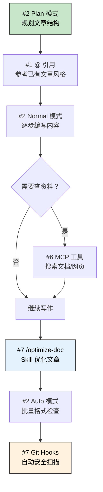

> **一句话定位**：这是一篇围绕 Claude Code `/powerup` 命令中 10 个交互演示的经验总结，帮你从"知道有这功能"到"在真实项目中用起来"。
>
> **核心理念**：工具的价值不在于功能数量，而在于你能把几个关键能力组合成自己的工作节奏。与其追求 10/10 全解锁，不如先把 3-4 个高频能力练成肌肉记忆。

---

## 3 分钟速览版

<details>
<summary><strong>点击展开：10 个 Power-Ups 一览表</strong></summary>

| # | Power-Up | 关键词 | 一句话理解 | 推荐优先级 |
|---|----------|--------|-----------|-----------|
| 1 | Talk to your codebase | `@` files, line refs | 用 `@` 引用替代自然语言描述，零歧义 | ★★★ |
| 2 | Steer with modes | shift+tab, plan, auto | 三种模式对应三种工作节奏 | ★★★ |
| 3 | Undo anything | /rewind, Esc-Esc | 安全网，敢试才敢用 | ★★★ |
| 4 | Run in the background | tasks, /tasks | 后台任务不阻塞主对话 | ★★☆ |
| 5 | Teach Claude your rules | CLAUDE.md, /memory | 项目规范持久化，减少重复沟通 | ★★★ |
| 6 | Extend with tools | MCP, /mcp | 外部能力接入的统一协议 | ★★☆ |
| 7 | Automate your workflow | skills, hooks | 可复用命令 + 事件驱动自动化 | ★★☆ |
| 8 | Multiply yourself | subagents, /agents | 并行探索，分而治之 | ★★☆ |
| 9 | Code from anywhere | /remote-control, /teleport | 多设备协作与会话迁移 | ★☆☆ |
| 10 | Dial the model | /model, /effort | 按任务复杂度选模型和推理深度 | ★★☆ |

</details>


建议学习顺序：先打好基础操作的底子，再把项目配置做扎实，最后探索进阶协作能力。下面按这个顺序展开。

---

## 第一轮：基础操作

### 1. Talk to your codebase — `@` files, line refs

**我的理解**：`@` 引用是 Claude Code 交互中投入产出比最高的习惯。一个 `@_config.yml:15` 胜过三句话的描述，因为它直接把文件内容注入上下文，Claude 看到的是代码本身而不是你对代码的描述。

**容易忽略的点**：

- `@` 不只能引用文件，还能引用到具体行号范围，比如 `@src/index.ts:10-25`
- 在较大项目中，精准 `@` 引用比让 Claude 自己搜索更快、更省 token
- 可以在一条消息中 `@` 多个文件，Claude 会综合分析它们的关系

**实践路径**：

```bash
# 第一步：体验基础引用
# 在 Claude Code 中输入：
@package.json 这个项目用了哪些 Hexo 插件？

# 第二步：精准到行
@_config.yml:35-50 这段 permalink 配置的具体效果是什么？

# 第三步：多文件联合分析
@_config.yml @_config.kratos-rebirth.yml 主配置和主题配置之间有哪些重叠或冲突？
```

**经验总结**：养成习惯——凡是涉及具体文件的问题，先 `@` 再问。这比"帮我看看配置文件"的效率高一个量级。

---

### 2. Steer with modes — shift+tab, plan, auto

**我的理解**：三种模式本质上对应三种信任度：

| 模式 | 信任度 | 适合场景 | 快捷键 |
|------|--------|---------|--------|
| Plan | 低 — 只读不改 | 复杂任务前的方案设计、代码审计 | `shift+tab` 切换 |
| Normal | 中 — 逐步确认 | 日常开发，需要审批每步操作 | 默认模式 |
| Auto | 高 — 自动执行 | 已验证的重复操作、测试运行 | `shift+tab` 切换 |

**容易忽略的点**：

- `shift+tab` 可以在对话中途随时切换，不需要重启会话
- Plan 模式下 Claude 只能读不能写，适合"先让 Claude 看看，我再决定"的场景
- Auto 模式虽然方便，但建议只在有 git 版本控制的目录下使用，保留回退能力

**实践路径**：

```bash
# 场景：你要重构一个配置文件，但不确定改动范围

# 1. 先切 Plan 模式（shift+tab 选 Plan）
请分析 _config.kratos-rebirth.yml，哪些配置项已经过时或冗余？

# 2. 看完方案，切回 Normal 模式逐步执行
# （shift+tab 选 Normal）
按刚才的分析，帮我清理第一项冗余配置

# 3. 如果是批量格式化这种低风险操作，切 Auto
# （shift+tab 选 Auto）
把 source/_posts/ 下所有文章的 frontmatter date 格式统一为 +0800 时区
```

**经验总结**：Plan → Normal → Auto 是一个自然的信任度递进过程。复杂任务从 Plan 开始，验证思路后切 Normal 执行，重复性操作交给 Auto。

---

### 3. Undo anything — /rewind, Esc-Esc

**我的理解**：`/rewind` 和 `Esc-Esc` 是 Claude Code 的安全网。有了它们，你才能放心让 Claude 做大胆的尝试——最坏情况也就是回退一步。

**两者的区别**：

| 操作 | 作用 | 类比 |
|------|------|------|
| `Esc-Esc` | 立即中断当前正在执行的操作 | 相当于 `Ctrl+C` |
| `/rewind` | 回退到对话中的任意历史节点，撤销所有文件改动 | 相当于 `git reset --hard` + 对话回滚 |

**容易忽略的点**：

- `/rewind` 不只是撤销消息，它会连同文件改动一起回退
- 这意味着你可以让 Claude 先试一种方案，不满意就 `/rewind` 试另一种，文件系统也会干净回退
- `Esc-Esc` 是"刹车"，`/rewind` 是"倒车"，两者配合使用

**实践路径**：

```bash
# 场景：想试两种不同的样式方案

# 方案 A
帮我把博客代码块的背景色改成深蓝色主题
# → Claude 修改了 custom.styl
# → 预览效果不满意

/rewind
# → 文件和对话都回到修改前

# 方案 B
帮我把博客代码块改成 GitHub 风格的浅色主题
# → 这次满意了，保留
```

**经验总结**：`/rewind` 降低了试错成本。以前会花时间在脑子里反复权衡"要不要让 AI 改"，现在直接让它改，不行就 rewind。

---

### 10. Dial the model — /model, /effort

**我的理解**：不是所有任务都需要最强模型和最深推理。合理搭配 `/model` 和 `/effort` 既省成本又不牺牲质量。

**搭配策略**：

| 任务类型 | 推荐配置 | 理由 |
|----------|---------|------|
| 简单查询、格式化 | Haiku + low effort | 快且便宜，够用就行 |
| 日常开发、代码修改 | Sonnet + medium effort | 性价比最优 |
| 架构设计、复杂调试 | Opus + high effort | 需要深度推理 |
| 关键决策、安全审计 | Opus + max effort | 最大化推理预算 |

**容易忽略的点**：

- `/effort` 调的是推理深度（thinking token 预算），不是模型本身
- 同一个 Opus 模型，`/effort low` 和 `/effort max` 的输出质量可以差很多
- Claude Pro 用户在 `/model` 中切换不影响计费模式，但 token 消耗量不同

**实践路径**：

```bash
# 对同一个问题测试不同配置

/effort low
解释 Hexo 的 permalink 配置语法

/effort max
分析我的博客部署流程中有哪些潜在的安全风险，给出具体的改进建议

# 感受差异：low 给你简洁答案，max 给你结构化深度分析
```

**经验总结**：默认用 high effort 是合理的起点，但当你意识到某个问题只需要快速回答时，主动降 effort 是一个好习惯。不用每次都"杀鸡用牛刀"。

---

## 第二轮：项目配置

### 5. Teach Claude your rules — CLAUDE.md, /memory

**我的理解**：`CLAUDE.md` 和 `/memory` 解决的是同一个问题——**减少重复沟通**。区别在于作用域：

| 机制 | 作用域 | 存储位置 | 适合内容 |
|------|--------|---------|---------|
| `CLAUDE.md` | 项目级 | 项目根目录，随代码版本控制 | 编码规范、架构约定、命令速查 |
| `/memory` | 用户级 | `~/.claude/` 个人目录 | 个人偏好、常用工作流、跨项目习惯 |

**容易忽略的点**：

- `CLAUDE.md` 是给团队看的——它随 git 提交，新成员 clone 下来 Claude 就自动遵守
- `/memory` 是给自己用的——比如"我喜欢中文回复"、"commit message 用英文"
- 两者冲突时，`CLAUDE.md` 优先（项目规范 > 个人偏好）
- `CLAUDE.md` 不需要一次写完，可以随项目演进持续补充

**实践路径**：

```bash
# 1. 查看当前记忆
/memory
# → 审查已有条目，删除过时的，补充新的

# 2. 审查项目规范
@CLAUDE.md 这份文档中有没有和当前项目实际情况不符的内容？

# 3. 从真实痛点出发补充规范
# 如果你发现 Claude 每次都忘记某个约定，就把它写进 CLAUDE.md
# 例如：发现 Claude 总是用 npm 而不是 pnpm
# → 在 CLAUDE.md 中明确标注 "Package Manager: pnpm (requires v9+)"
```

**经验总结**：`CLAUDE.md` 最大的价值是"写一次，省百次"。我的博客项目 `CLAUDE.md` 覆盖了文件命名、更新记录、安全检查、图片管理等所有关键约定，新会话启动后 Claude 自动遵守，不需要每次重复交代。

---

### 6. Extend with tools — MCP, /mcp

**我的理解**：MCP（Model Context Protocol）是 Claude Code 的"外挂系统"。通过它，Claude 可以调用外部工具——GitHub API、Web 搜索、数据库查询、自定义服务等。

**当前项目已接入的 MCP 服务**：

| MCP 服务 | 能力 | 使用场景 |
|----------|------|---------|
| GitHub | Issue/PR/代码搜索 | 查看部署状态、管理 PR |
| Web Search | 网页搜索 | 查找最新文档、解决方案 |
| Context7 | 框架文档查询 | 查 Hexo/pnpm 等最新 API |
| Web Reader | 网页内容读取 | 抓取参考文章内容 |

**容易忽略的点**：

- `/mcp` 可以在会话中动态启用/禁用 MCP 服务器，不需要重启
- MCP 服务有认证要求时（如 GitHub），需要提前配置好 token
- 并非所有场景都需要 MCP——本地文件操作 Claude 原生就能做，MCP 解决的是"需要访问外部系统"的问题

**实践路径**：

```bash
# 1. 查看当前 MCP 状态
/mcp
# → 检查哪些服务已连接、哪些断开

# 2. 用 GitHub MCP 查看项目状态
查看 leahana/leahana.github.io 仓库最近的 PR 和部署状态

# 3. 用 Context7 查文档
查一下 Hexo 8.x 的 tag plugins 有没有新增语法
```

**经验总结**：MCP 的核心价值是让 Claude 从"只能看本地文件"变成"能访问你的整个工具链"。一旦配好，很多原本需要切换浏览器、手动复制粘贴的操作，直接在对话中就能完成。

---

### 7. Automate your workflow — skills, hooks

**我的理解**：Skills 和 Hooks 是两种自动化机制，解决不同层面的问题：

| 机制 | 触发方式 | 类比 | 适合场景 |
|------|---------|------|---------|
| Skills | 手动调用 `/skill-name` | Shell alias | 可复用的复杂工作流 |
| Hooks | 事件自动触发 | Git hooks | 质量门禁、自动格式化 |

**当前项目的实际配置**：

- **Skills**: `/optimize-doc`（文章优化）、`/save`（会话存档）、`/security-review`（安全审查）
- **Hooks**: `.githooks/pre-commit`（敏感信息扫描）、`.githooks/pre-push`（全量扫描 + 图片 URL 检查）

**容易忽略的点**：

- Skills 存放在 `.claude/skills/` 目录，本质是 Markdown 文件定义的 prompt 模板
- Hooks 可以绑定 Claude 的工具调用事件（`PreToolUse`、`PostToolUse`），不只是 Git hooks
- 项目级 skills 优先于全局 skills，避免命名冲突

**实践路径**：

```bash
# 1. 体验已有 skill
/optimize-doc source/_posts/tech/tools/某篇文章.md

# 2. 查看 skill 定义，理解它的工作原理
@.claude/skills/optimize-doc.md 这个 skill 的流程是什么？

# 3. 考虑是否需要新 skill
# 如果你经常执行"创建新文章 → 填写 frontmatter → 设置分类"这套流程
# 可以创建一个 /new-post skill 来一键完成

# 4. 验证 hooks 是否正常工作
pnpm check:secrets
```

**经验总结**：Skills 适合"我经常做这件事，想一键触发"；Hooks 适合"这件事必须每次都做，不能忘"。两者组合覆盖了主动和被动两种自动化需求。

---

## 第三轮：进阶协作

### 4. Run in the background — tasks, /tasks

**我的理解**：后台任务解决的核心问题是**不阻塞**。让 Claude 在后台跑一个耗时操作，你在前台继续做别的事。

**和 subagent 的区别**：

| 能力 | 后台任务 | Subagent |
|------|---------|----------|
| 启动方式 | 对话中创建 | Claude 自动调度或手动请求 |
| 上下文 | 共享主会话上下文 | 独立上下文 |
| 查看进度 | `/tasks` | 等待返回结果 |
| 适合场景 | 单个耗时操作 | 并行的多个独立任务 |

**实践路径**：

```bash
# 场景：你想检查所有文章的质量，但不想等着

# 1. 创建后台任务
帮我扫描 source/_posts/ 下所有文章，检查：
- 缺少 description 字段的
- 没有更新记录表的
- frontmatter date 格式不规范的
（这个任务在后台跑就行）

# 2. 继续前台工作
# 不用等，直接开始写新文章或做其他事

# 3. 随时查看进度
/tasks
```

**经验总结**：后台任务最适合"审计类"工作——扫描、统计、检查。这些任务不需要你盯着看过程，只需要看最终报告。

---

### 8. Multiply yourself — subagents, /agents

**我的理解**：Subagents 是"分身术"。当一个任务可以拆成多个独立子问题时，让多个 agent 并行处理，然后汇总结果。

**Agent 类型和适用场景**：

| Agent 类型 | 特长 | 典型用法 |
|-----------|------|---------|
| Explore | 代码搜索和理解 | "这个项目的认证流程是什么？" |
| Plan | 方案设计 | "设计一个缓存策略" |
| General-purpose | 多步骤复杂任务 | "调研 + 实现 + 测试" |

**容易忽略的点**：

- 每个 subagent 上下文独立，所以启动时需要给足背景信息
- 并行启动多个 agent 要在同一条消息中发出，不能分多条
- Agent 结果返回后需要主对话做综合——不要指望 agent 之间自动协调
- Worktree 隔离模式（`isolation: "worktree"`）可以让 agent 在独立的 git 分支中工作，不影响主目录

**实践路径**：

```bash
# 场景：想全面了解博客项目的现状

# 同时启动 2 个 Explore agent：
# Agent 1: 分析所有文章的分类和标签分布，输出统计
# Agent 2: 检查主题配置中有哪些功能已启用/未启用

# Claude 会并行执行，分别返回结果
# 你在主对话中汇总两份报告，形成博客内容地图

# 进阶：用 worktree 隔离做实验性修改
# Agent 在独立分支修改代码，确认可行后再 merge 回来
```

**经验总结**：Subagents 的关键是"拆得开、合得回"。先想清楚任务能不能拆成独立子问题，能拆就用 agent 并行；拆不开（有依赖关系）就老老实实串行处理。

---

### 9. Code from anywhere — /remote-control, /teleport

**我的理解**：这两个命令解决的是**多设备、多终端协作**的问题：

| 命令 | 作用 | 类比 |
|------|------|------|
| `/remote-control` | 从另一个终端向运行中的 Claude 实例发送指令 | SSH 到正在运行的进程 |
| `/teleport` | 把当前会话的完整上下文迁移到另一台设备 | `tmux` 的 session 迁移 |

**典型使用场景**：

- 在 Mac 上用 Claude Code 启动了一个长任务，切到 iPad SSH 终端用 `/remote-control` 查看进度或追加指令
- 在公司电脑上分析完代码，用 `/teleport` 把上下文带回家继续

**容易忽略的点**：

- `/remote-control` 需要当前有一个运行中的 Claude 实例，它不是启动新实例
- `/teleport` 迁移的是对话上下文，不是文件——目标设备需要有相同的代码仓库
- 这两个功能在网络不稳定时（如手机热点）要注意连接中断问题
- `/remote-control` 也可以被脚本调用，实现自动化流水线中嵌入 Claude

**实践路径**：

```bash
# 终端 A（主工作终端）
claude
# → 正常工作中...

# 终端 B（另一个终端窗口或 SSH 连接）
claude /remote-control
# → 可以向终端 A 的 Claude 实例发送指令
# → 比如追加一条："顺便也检查一下图片链接是否有效"

# 跨设备迁移
# 在设备 A 上：
/teleport
# → 获得一个迁移码或链接

# 在设备 B 上：
claude --resume <迁移信息>
# → 完整恢复上下文，继续工作
```

**经验总结**：`/remote-control` 和 `/teleport` 把 Claude Code 从"单终端工具"变成了"多端协作平台"。对于需要在多台设备间切换的开发者，这两个能力让"上下文切换"的成本大幅降低。

---

## 组合工作流：一次真实的博客写作过程

实际使用中，这 10 个能力不是孤立的，而是自然组合在一起的。以下是一次典型的博客写作流程中涉及的 Power-Ups：



一次工作流串联了 #1、#2、#6、#7 四个 Power-Up。不需要刻意使用所有能力，而是让它们在需要的时候自然出现。

---

## 更新记录

| 版本 | 日期 | 说明 |
|------|------|------|
| v1.0 | 2026-04-02 | 初始版本 |
