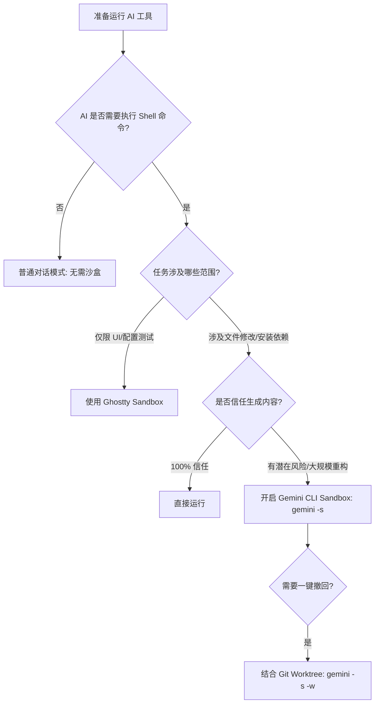

> **核心摘要**：当 AI 从“对话框”走向“生产环境”，其对本地文件系统的操作权限成了安全重灾区。本文探讨为何 AI Sandbox 是开发者必备的“隔离服”，并详解 Gemini CLI 与 Ghostty 两种不同维度的沙盒实践。

<details>
<summary><b>⏱️ 3分钟速览版：核心对比与安全决策</b></summary>

### 核心对比：两种沙盒的维度差异

| 特性 | **Ghostty Sandbox (终端配置隔离)** | **Gemini CLI Sandbox (系统资源隔离)** |
| :--- | :--- | :--- |
| **隔离层级** | **应用层 (Shell Runtime)** | **系统层 (Process/Kernel)** |
| **防御目标** | 配置污染、环境变量冲突 | 恶意指令执行、数据窃取、物理删库 |
| **文件访问** | **完全开放**。与普通终端无异 | **严格受限**。仅限项目目录白名单 |
| **网络权限** | 继承主机网络 | **默认禁用**（防止 Prompt 注入攻击外泄数据） |
| **典型场景** | 测试新插件、多环境切换 | 重构代码、运行 AI 生成的测试脚本 |

### 安全决策流程



</details>

## 1. 为什么我们迫切需要 AI Sandbox？

在过去，AI 只是一个“建议者”；而现在，随着 Gemini CLI 等 Agent 工具的普及，AI 变成了“执行者”。这种角色的转变带来了前所未有的安全风险。

### 1.1 从“幻觉”到“破坏”的升级
传统的 LLM 幻觉最多导致代码写错，但具备 Shell 执行能力的 AI 幻觉可能导致：
*   **误操作风险**：AI 可能在理解 `rm -rf` 的范围时出错，误删项目外的备份目录。
*   **指令注入攻击 (Prompt Injection)**：如果 AI 在处理第三方文档或不受信任的代码时被注入了恶意指令，它可能会尝试读取你的 `~/.ssh/id_rsa` 并通过网络发送出去。
*   **供应链攻击**：AI 生成的脚本可能引用了包含后门的 npm 包，而在无隔离环境下安装这些包会自动触发 `preinstall` 恶意脚本。

### 1.2 隔离的本质：最小权限原则 (PoLP)
AI Sandbox 的必要性在于将 AI 的操作范围限定在“必要且最小”的范围内。它不仅是保护主机，更是给开发者提供一个**“试错实验室”**，让你敢于让 AI 处理成千上万行代码的重构，而不必担心它跳出项目边界。

## 2. 深度剖析：Gemini CLI 的系统级隔离

Gemini CLI 的沙盒（开启标志 `-s`）是一个底层的安全屏障，它根据不同的操作系统调用不同的内核能力。

### 2.1 技术实现细节
*   **macOS (Seatbelt)**：利用 Apple 的内核沙盒框架（`sandbox-exec`）。它通过一个 `.sb` 配置文件，精确定义哪些目录可写、哪些端口可访问。这使得 AI 进程即使拥有 Root 权限，也无法跨越内核设定的红线。
*   **Linux (Docker/gVisor)**：将 AI 运行在 OCI 容器中。通过 `bind-mount` 仅挂载当前项目目录。高级用户可以配合 `gVisor`（runsc）实现更强的内核态隔离。
*   **Windows (AppContainer)**：使用低完整性级别（Low Integrity Level）运行进程，限制其对敏感注册表和系统文件的访问。

### 2.2 核心安全策略
在 Gemini CLI 的 `.gemini/settings.json` 中，你可以定义严苛的隔离策略：
```json
{
  "tools": {
    "sandbox": "docker",
    "sandboxNetworkAccess": false, // 彻底断网，杜绝数据外泄
    "sandboxAllowedPaths": ["./src", "./tests", "/tmp/build-cache"], // 仅允许访问这些路径
    "sandboxReadOnlyPaths": ["/etc/hosts"] // 一些只能读不能改的参考文件
  }
}
```

## 3. Ghostty Sandbox：应用层的“洁癖”

与 Gemini CLI 的硬核隔离不同，Ghostty 的沙盒更多是为了**环境管理**。

### 3.1 它的优势
当你需要一个干净的终端环境来测试 AI 生成的 Zsh 插件或复杂的 `alias` 时，Ghostty 的沙盒极速且轻量。它通过修改 `ZDOTDIR` 让你的 Shell 认为 `~/` 是另一个空目录，从而保护了你主机的 `.zshrc` 不被改乱。

### 3.2 它的局限
Ghostty 沙盒无法阻止一个恶意程序通过绝对路径（如 `/Users/name/.ssh`）读取文件。因此，它**不能替代** Gemini CLI 的系统沙盒。

## 4. 实战指南：打造“无感”的安全流程

开启沙盒不应以牺牲效率为代价。

### 4.1 方案 A：快速重构（沙盒 + 持久化）
如果你正在进行一项高风险的重构，但又不确定 AI 会改写哪些文件：
```bash
gemini -s "全面重构 src/legacy 目录下的过时代码"
```
**安全说明**：改动是实时写入硬盘的，即使 AI 崩溃，进度也不会丢失。

### 4.2 方案 B：实验性探索（沙盒 + Git 工作树）
这是目前最推荐的“终极方案”：
```bash
gemini -s -w
```
1.  `-s` 确保 AI 不能偷看你的私钥。
2.  `-w` 创建一个独立的 Git 工作区目录。
3.  任务结束后，在主窗口检查工作区差异，满意则合并，不满意则 `git worktree remove`。

### 4.3 跨窗口协作与 Session 管理
在使用 Gemini CLI 时，如果你需要在不同窗口间同步任务，请善用 Session ID，但务必注意隐私保护：

*   **获取当前 Session ID**：在对话中输入 `/stats session`。
*   **恢复对话**：
    ```bash
    gemini --resume <YOUR_SESSION_ID>
    ```
*   **最佳实践**：在分享或记录对话时，建议将具体的 ID 替换为说明文字，或使用 `/title` 命令为会话命名，方便通过 `gemini --resume` 的交互界面快速查找。

## 5. 总结：安全不是阻碍，而是加速器

在 AI 辅助开发的今天，Sandbox 不再是一个可选的“高级选项”，而应当成为默认的工作流。

*   **Ghostty Sandbox** 负责环境的**整洁**。
*   **Gemini CLI Sandbox** 负责系统的**安全**。

当这两个工具结合使用时，你便拥有了一个既能随心所欲实验配置，又能放心地让 AI 操作核心代码的安全港湾。

---

## 更新记录

| 版本 | 日期 | 说明 |
|------|------|------|
| v1.0 | 2026-04-02 | 初始版本。 |
| v2.0 | 2026-04-02 | 大幅扩充内容，增加 AI Sandbox 必要性探讨，优化对比架构，脱敏处理 Session ID。 |
