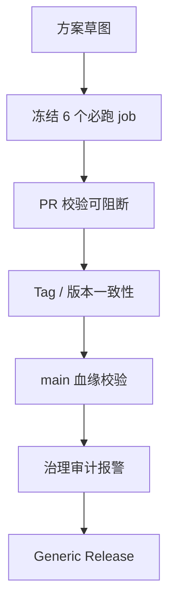
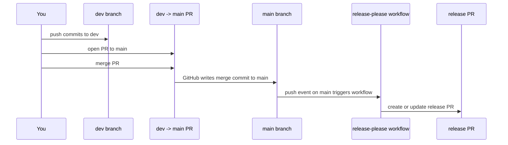

> 🎯 **一句话定位**：这是一篇把 GitHub Actions 从“仓库里有几份 YAML”收敛成“PR、Release、治理审计都可实施”的最小教程。
>
> 💡 **核心理念**：先达成 Go，再逐步收紧到 Go+。不要一上来堆满矩阵、变体和复用工作流，而是先把单版本发布、必跑门禁、`main` 血缘校验和治理漂移报警锁死。

---

## 问题背景

很多团队说“我们已经有 CI 方案了”，实际状态却只是仓库里放了几份 `workflow`。只要这些 `workflow` 没有被分支保护、`required checks`、`tag ruleset` 和发布前置校验真正接住，这套方案就还是“看起来完整”，而不是“可以实施”。

### 为什么“有计划”不等于“可实施”

- `job` 名称没有冻结时，`required checks` 很容易因为改名而漂移。
- Release 只看 `tag` 触发时，任何分支都可能打出正式版本。
- 版本号分散在多个文件里时，`tag` 和代码版本迟早会不一致。
- 仓库治理设置一旦被手工改动，如果没有审计任务，`include administrators`、`bypass` 和 `tag ruleset` 的漂移不会自动报警。

> 实践案例补充：在对话记录 `019d5258-3b8a-7d02-bcf7-a5cc0bbb4d4c` 围绕 `m2c-pipeline` 的那轮审查里，我们不是先追求“满配治理”，而是先问 4 个更务实的问题：PR 是否真的会被拦住，Release 是否只能从 `main` 发，版本是否只有一个真源，治理设置漂移后能不能自动报警。本文的最小方案，就是沿着这条收紧路径整理出来的。



### 怎么验证你是不是还停留在“只有计划”的阶段

如果下面任意一项回答不够确定，就说明还没到“可实施”：

- 你的分支保护里，是否已经锁定了固定的 `required checks` 名称。
- 你的 Release 是否明确拒绝来自非 `main` 血缘的 `tag`。
- 你的版本号是否只有一个来源，`tag` 校验是否直接对比它。
- 你的仓库设置漂移时，是否会在 GitHub Actions 里自动失败。

## 最小目标

### 为什么要先收敛目标

最容易把 CI 方案做散的地方，不是 YAML 不会写，而是范围一开始就太大。你一旦同时想做多版本、多个发布变体、复杂矩阵、复用工作流和治理审计，最后很容易变成每一块都做了 60 分，但没有一块真正可上线。

### 最小做法

这篇文章只做下面这些事：

| 维度 | 这次要做到 | 这次不做 |
|------|------------|----------|
| 发布物 | 只发布 `generic` 单版本包 | 不做 `codex` 变体 |
| 版本 | 只认一个版本源 | 不做多处版本同步 |
| PR 门禁 | 固定 6 个 `job` 名称 | 不引入矩阵测试 |
| Release | 只加 3 个核心 guard | 不扩展多环境发布 |
| 治理 | 先做到可审计 | 不一开始追求全套企业规则 |

这里的思路很简单：先把 Go 做到位，也就是“能稳定拦住不该进主干和不该发版的变更”；等这条链路跑顺以后，再补 `required-job-contract`、更严格的打包校验和更细的治理拆分，把它收紧到 Go+。

### 怎么验证范围收敛是成功的

- 你能在一个仓库里只靠 3 个 `workflow` 跑通 PR、Release 和治理审计。
- 你能解释每个 `job` 的存在理由，而不是“先加上，后面再说”。
- 你能用一次 PR、一次 `tag` 和一次手动审计，把整条链路走完。

## 最小目录

### 为什么目录要先冻结

目录一旦不稳定，后面的 `workflow`、脚本入口、版本校验和打包规则都会变成隐性耦合。最小落地时，先把“哪些文件是门禁链路的一部分”定死，后面排错会轻松很多。

### 最小做法

下面这组文件，已经足够支撑一条可实施的最小链路：

```text
.
|-- .github/
|   `-- workflows/
|       |-- ci.yml
|       |-- release-generic.yml
|       `-- governance-audit.yml
|-- m2c_pipeline/
|   `-- version.py
|-- policy/
|   `-- governance.json
`-- scripts/
    `-- ci/
        |-- check_pr_head.py
        |-- check_skill_spec.py
        |-- check_repo_policy.py
        |-- check_release_tag.py
        |-- governance_audit.py
        |-- package_generic.py
        `-- check_required_job_contract.py
```

其中：

- `ci.yml`、`release-generic.yml`、`governance-audit.yml` 是三条主链路。
- `m2c_pipeline/version.py` 是单一版本源。
- `policy/governance.json` 用来冻结 `required checks`、默认分支和 `tag` 规则。
- `scripts/ci/check_required_job_contract.py` 属于 Go+ 扩展，用来防止 `required checks` 名单和 `ci.yml` 实际 `job` 名称漂移。

### 怎么验证目录是够用的

- 删除这组文件之外的 CI 相关文件后，PR、Release 和审计仍然能跑通。
- 任何一个 `workflow` 的核心逻辑，都能在 `scripts/ci/` 找到对应脚本。
- 版本号变更时，你只需要改 `m2c_pipeline/version.py` 一处。

## GitHub Actions 最小落地步骤

### 第 1 步：冻结单一版本源和治理契约

为什么要做：

- 没有单一版本源，就没有可靠的 `tag` 校验。
- 没有治理契约，分支保护和 `required checks` 迟早会和代码脱节。

最小做法：

- 在 `m2c_pipeline/version.py` 里只保留一个 `__version__`。
- 在 `policy/governance.json` 里冻结默认分支、`required checks`、`release_tag_regex` 和 `tag ruleset`。
- 需要进一步收紧时，再加一个 `check_required_job_contract.py`，专门比对治理契约和 `ci.yml` 的 `job` 名单。

怎么验证：

- 本地执行 `python scripts/ci/check_release_tag.py --tag v0.1.0`，确认 `tag` 和版本一致时通过，不一致时失败。
- 修改 `policy/governance.json` 里的 `required_checks` 后，再跑治理或合同校验，确认它会立刻报警。

### 第 2 步：把 PR 校验收敛成 6 个固定 job

为什么要做：

- GitHub 的分支保护不是“认 workflow”，而是“认 status check 名称”。
- 所以最重要的不是 job 数量，而是 job 名称必须稳定，且和仓库设置一一对应。

最小做法：

- `ci.yml` 里固定这 6 个 `job` 名称：`policy-pr-head`、`skill-spec`、`repo-policy`、`unit-tests`、`offline-smoke`、`package-dryrun`。
- 这 6 个名字同步填到分支保护的 `required checks`。
- 不给 `ci.yml` 增加 `paths` 或 `paths-ignore`，避免 required gate 被绕过或长期 `pending`。

怎么验证：

- 提一个 PR，确认页面上恰好出现这 6 个状态名。
- 故意把某个 `job` 改名，再看分支保护是否立刻暴露出名称漂移问题。

### 第 3 步：给 Release 加 3 个核心 guard

为什么要做：

- 只靠 `on.push.tags` 触发 Release，解决不了“这个 `tag` 到底是不是正式代码”的问题。
- 真正能拦住越权发布的，是版本一致性、`main` 血缘和发布动作三段式组合。

最小做法：

- `version-guard`：校验 `tag` 是否匹配 `version.py`。
- `main-ancestry-guard`：用 `fetch-depth: 0` 和 `git merge-base --is-ancestor` 确认当前提交来自 `origin/main`。
- `build-and-release`：只在前两个 guard 通过后执行，打出 `generic` 包并创建 GitHub Release。

怎么验证：

- 用 `vX.Y.Z` 给 `main` 上的提交打标签，确认流程通过。
- 给功能分支打同样格式的 `tag`，确认血缘校验失败。
- 把 `version.py` 改成 `0.1.0`，却打 `v0.1.1`，确认版本校验失败。

### 第 4 步：加 governance audit，让设置漂移会报警

为什么要做：

- CI 代码是可见的，但仓库设置经常是“看不见的生产配置”。
- 一旦有人手工改掉 `include administrators`、给分支保护加 bypass，或者移除了 `tag ruleset`，仓库本身不会自动告诉你。

最小做法：

- 准备一个有仓库治理读取权限的 `REPO_ADMIN_AUDIT_TOKEN`。
- 通过 `governance_audit.py` 检查分支保护的 `required checks`、`include administrators` 和 `bypass`。
- 同时检查 `tag ruleset` 是否还处于 `active` 状态，是否匹配 `refs/tags/v*`，以及 `update` / `deletion` 规则是否都还在。

怎么验证：

- 临时移除一个 `required check`，手动触发审计，确认会失败。
- 临时给分支保护增加 bypass 用户或团队，再跑一次审计，确认会失败。
- 临时停用 `tag ruleset` 或删掉 `update` 规则，再跑一次审计，确认会失败。

### 第 5 步：跑一次端到端验收

为什么要做：

- 只看 YAML 不够，只有把 PR、离线验证、`tag` 发布和治理审计都走一遍，才算真正落地。

最小做法：

- 用一个 PR 验证 6 个固定门禁。
- 用离线 `fallback` 跑一次 dry-run，确认核心命令在本地或 CI 都能执行。
- 用一个正式格式的 `tag` 触发 Release。
- 手动触发一次治理审计，确认当前设置和契约一致。

怎么验证：

```bash
python -m m2c_pipeline <input> --dry-run --translation-mode fallback
```

在 `m2c-pipeline` 这个仓库里的对应验证命令是：

```bash
python -m m2c_pipeline tests/fixtures/test_input.md --dry-run --translation-mode fallback
```

如果你的仓库已经约定了根目录 `venv` 入口，那么把上面的 `python` 统一替换成 `./venv/bin/python` 即可。我们在 `m2c-pipeline` 的实践里，后续也是沿着这条思路把本地和 GitHub Actions 的解释器入口收紧到同一套约定。

## 关键 YAML 示例

### `ci.yml`：6 个固定 job 的最小版本

为什么要这样写：

- 这 6 个 `job` 就是你要锁进分支保护的“门禁清单”。
- 它们可以以后扩展实现，但名字不要轻易动。

最小做法如下：

```yaml
name: ci

on:
  pull_request:
  push:
    branches:
      - main

permissions:
  contents: read

jobs:
  policy-pr-head:
    name: policy-pr-head
    runs-on: ubuntu-latest
    steps:
      - uses: actions/checkout@v4
      - run: python scripts/ci/check_pr_head.py

  skill-spec:
    name: skill-spec
    runs-on: ubuntu-latest
    steps:
      - uses: actions/checkout@v4
      - run: python scripts/ci/check_skill_spec.py

  repo-policy:
    name: repo-policy
    runs-on: ubuntu-latest
    steps:
      - uses: actions/checkout@v4
      - run: python scripts/ci/check_repo_policy.py

  unit-tests:
    name: unit-tests
    runs-on: ubuntu-latest
    steps:
      - uses: actions/checkout@v4
      - uses: actions/setup-python@v5
        with:
          python-version: "3.11"
      - run: python -m pip install -r requirements.txt
      - run: python -m unittest discover -s tests -p "test_*.py"

  offline-smoke:
    name: offline-smoke
    runs-on: ubuntu-latest
    steps:
      - uses: actions/checkout@v4
      - uses: actions/setup-python@v5
        with:
          python-version: "3.11"
      - run: python -m pip install -r requirements.txt
      - run: python -m m2c_pipeline tests/fixtures/test_input.md --dry-run --translation-mode fallback

  package-dryrun:
    name: package-dryrun
    runs-on: ubuntu-latest
    steps:
      - uses: actions/checkout@v4
      - uses: actions/setup-python@v5
        with:
          python-version: "3.11"
      - run: python -m pip install -r requirements.txt
      - run: python scripts/ci/package_generic.py --output-dir dist
```

怎么验证：

- PR 页面上必须出现这 6 个状态名，且和分支保护配置完全一致。
- 如果你要走 Go+，就在这个基础上再补一个 `required-job-contract`，专门防止 `required checks` 漂移。

### `release-generic.yml`：3 个核心 job 的最小版本

为什么要这样写：

- `version-guard` 和 `main-ancestry-guard` 是正式发布前的最小闭环。
- `build-and-release` 必须只在两个 guard 都通过后才执行。

最小做法如下：

```yaml
name: release-generic

on:
  push:
    tags:
      - "v*"

permissions:
  contents: read

concurrency:
  group: release-${{ github.ref }}
  cancel-in-progress: false

jobs:
  version-guard:
    name: version-guard
    runs-on: ubuntu-latest
    steps:
      - uses: actions/checkout@v4
      - run: python scripts/ci/check_release_tag.py

  main-ancestry-guard:
    name: main-ancestry-guard
    runs-on: ubuntu-latest
    steps:
      - uses: actions/checkout@v4
        with:
          fetch-depth: 0
      - run: |
          git fetch origin main --tags
          git merge-base --is-ancestor "$GITHUB_SHA" "origin/main"
        shell: bash

  build-and-release:
    name: build-and-release
    runs-on: ubuntu-latest
    needs:
      - version-guard
      - main-ancestry-guard
    permissions:
      contents: write
    steps:
      - uses: actions/checkout@v4
      - uses: actions/setup-python@v5
        with:
          python-version: "3.11"
      - run: python -m pip install -r requirements.txt
      - run: python scripts/ci/package_generic.py --output-dir dist
      - run: |
          VERSION="$(python -c 'from m2c_pipeline.version import __version__; print(__version__)')"
          ZIP_PATH="dist/m2c-pipeline-generic-v${VERSION}.zip"
          SHA_PATH="${ZIP_PATH}.sha256"
          gh release create "$GITHUB_REF_NAME" "$ZIP_PATH" "$SHA_PATH" \
            --title "$GITHUB_REF_NAME" \
            --notes "Generic release package"
        env:
          GH_TOKEN: ${{ github.token }}
        shell: bash
```

怎么验证：

- `fetch-depth: 0` 和 `git fetch origin main --tags` 必须同时存在，否则 `main` 血缘判断很容易失真。
- 在正式仓库里，可以像 `m2c-pipeline` 一样再补一个 `governance-precheck`，把治理审计前置到发布链路里。

### `governance-audit.yml`：最小治理审计入口

为什么要这样写：

- 它的目标不是替代仓库设置，而是盯住仓库设置有没有漂移。
- 只要支持手动触发和定时触发，最小闭环就成立了。

最小做法如下：

```yaml
name: governance-audit

on:
  schedule:
    - cron: "17 2 * * *"
  workflow_dispatch:

permissions:
  contents: read

jobs:
  governance-audit:
    name: governance-audit
    runs-on: ubuntu-latest
    steps:
      - uses: actions/checkout@v4
      - uses: actions/setup-python@v5
        with:
          python-version: "3.11"
      - run: python scripts/ci/governance_audit.py --mode all
        env:
          GITHUB_TOKEN: ${{ secrets.REPO_ADMIN_AUDIT_TOKEN }}
```

对应的核心审计逻辑可以收敛成下面这组判断：

```python
expected_contexts = sorted(contract["required_checks"])
contexts = sorted(required_checks.get("contexts", []))
if contexts != expected_contexts:
    raise RuntimeError("required checks drift")

if not enforce_admins.get("enabled", False):
    raise RuntimeError("include administrators must stay enabled")

bypass_allowances = (
    protection.get("required_pull_request_reviews", {}) or {}
).get("bypass_pull_request_allowances", {}) or {}
if any(bypass_allowances.get(key) for key in ("users", "teams", "apps")):
    raise RuntimeError("branch protection bypass must stay empty")

if ruleset.get("bypass_actors", []) or []:
    raise RuntimeError("tag ruleset bypass must stay empty")

include_patterns = ((ruleset.get("conditions", {}) or {}).get("ref_name", {}) or {}).get("include", [])
if "refs/tags/v*" not in include_patterns:
    raise RuntimeError("tag ruleset include pattern drift")
```

怎么验证：

- 在分支保护里删掉一个 `required check`，再手动跑一次，应该失败。
- 关闭 `include administrators`，再跑一次，应该失败。
- 给 `tag ruleset` 增加 bypass actor，或者删掉 `update` / `deletion` 规则，再跑一次，也应该失败。

### `version.py`：单一版本源与 `tag` 对比

为什么要这样写：

- 单一版本源越简单，发布链路越不容易漂移。
- `tag` 校验不要自己再维护第二套版本号，直接读源码里的版本定义。

最小做法如下：

```python
# m2c_pipeline/version.py
"""Version metadata for m2c_pipeline."""

__version__ = "0.1.0"
```

```python
# scripts/ci/check_release_tag.py
import os
import re

from m2c_pipeline.version import __version__


def validate_release_tag(tag: str) -> None:
    if not re.fullmatch(r"^v\d+\.\d+\.\d+$", tag):
        raise ValueError("invalid release tag format")

    expected = f"v{__version__}"
    if tag != expected:
        raise ValueError(f"tag {tag!r} does not match version {expected!r}")


validate_release_tag(os.environ["GITHUB_REF_NAME"])
```

怎么验证：

- `version.py` 改成 `0.2.0` 时，只有 `v0.2.0` 能通过。
- 任意 `v0.2`、`release-0.2.0` 或 `v0.2.1` 都必须失败。

## 严格验收清单

### 为什么一定要有验收清单

CI 最怕“大家都觉得已经配好了”。真正能防止回归的，不是感觉，而是一张每次发版前都能逐条勾掉的清单。

### 最小做法

发布前，下面这些项必须全部通过：

- [ ] `ci.yml` 中 6 个固定 `job` 名称与分支保护中的 `required checks` 完全一致。
- [ ] PR 提交后，这 6 个状态都能真实运行，不存在被 `paths-ignore` 或条件逻辑跳过的门禁。
- [ ] `python -m m2c_pipeline <input> --dry-run --translation-mode fallback` 可以在本地或 CI 正常执行。
- [ ] `m2c_pipeline/version.py` 是唯一版本源，`tag` 命名满足 `vX.Y.Z`。
- [ ] `release-generic.yml` 中 `version-guard`、`main-ancestry-guard`、`build-and-release` 三个核心 `job` 都按依赖顺序执行。
- [ ] `main-ancestry-guard` 使用了 `fetch-depth: 0`，并执行了 `git fetch origin main --tags`。
- [ ] 分支保护启用了 `include administrators`，且 bypass 为空。
- [ ] `tag ruleset` 仍然处于 `active`，并覆盖 `refs/tags/v*`。
- [ ] 治理审计可以通过手动触发发现设置漂移。
- [ ] Release 产物只输出 `generic` 包与对应校验文件。

### 怎么验证

- 先走一次 PR，确认 6 个门禁都绿。
- 再打一枚测试 `tag`，确认 Release 成功。
- 最后手动触发一次治理审计，确认当前仓库设置和契约一致。

## 常见坑与修复

### 1. `job` 改名后，分支保护看起来还在，其实已经失效

为什么会踩坑：

- GitHub 锁的是 `status check` 名称，不是“这个功能大概还在”。

最小修复：

- 固定 6 个 `job` 名称。
- 把这 6 个名字冻结到 `policy/governance.json`。
- 如果要走 Go+，再加一个 `check_required_job_contract.py`，自动比对 `ci.yml` 和治理契约。

怎么验证：

- 故意把 `offline-smoke` 改名成别的，再看校验是否能及时失败。

### 2. `tag` 不是从 `main` 打出来，仍然触发了正式发布

为什么会踩坑：

- `on.push.tags` 只认事件，不认这次事件是不是来自主干血缘。

最小修复：

- 在 `main-ancestry-guard` 里使用 `fetch-depth: 0`。
- 显式执行 `git fetch origin main --tags`。
- 用 `git merge-base --is-ancestor "$GITHUB_SHA" "origin/main"` 做血缘判断。

怎么验证：

- 从功能分支打一个合法格式的 `tag`，确认 Release 被拦住。

### 3. 打包脚本只看路径字符串，没防 `symlink` 逃逸

为什么会踩坑：

- 只做字符串白名单时，软链接可能把仓库外文件偷偷带进发布包。

最小修复：

- 遍历目录时显式拒绝 `symlink` 文件和目录。
- 用 `resolve_within_repo()` 之类的真实路径校验，确认所有文件都还在仓库根目录之下。

怎么验证：

- 故意在 allowlist 目录下放一个指向仓库外部的软链接，确认打包脚本直接失败。

### 4. `required check` 被 `paths-ignore` 或条件判断跳过

为什么会踩坑：

- 对 required gate 来说，“没跑”不是优化，往往只会造成 `pending`、误判，或者让门禁语义变得不稳定。

最小修复：

- 不给 `ci.yml` 增加 `paths` / `paths-ignore`。
- 把“可以跳过的逻辑”放在脚本内部做判断，而不是让 required `job` 本身不触发。

怎么验证：

- 修改任意路径都触发一次 PR，确认 required gate 始终按固定名称出现。

### 5. 本地用 `venv`，CI 却跑系统 `python`

为什么会踩坑：

- 本地和 CI 的解释器入口不一致时，最常见的结果就是“本地绿，线上红”。

最小修复：

- 最小教程阶段可以统一写成 `python`，但一旦仓库约定了固定解释器入口，就要在本地和 GitHub Actions 一起收紧。
- 在 `m2c-pipeline` 的实践里，后续就是把执行入口统一到 `./venv/bin/python`，避免环境语义漂移。

怎么验证：

- 本地和 CI 使用同一套依赖安装方式与 Python 入口，再跑一次 `unit-tests` 和 `offline-smoke`。

## 实战补遗：从 `release-generic` 迁到 `release-please`

### 为什么值得补这一段

前文的 `release-generic` 适合先把“正式发布不能乱发”这条链路做稳，但当仓库开始想沉淀更接近成熟开源项目的工作流时，只靠 `tag` 驱动发布会慢慢暴露出两个限制：

- 版本号、`CHANGELOG.md`、发布说明还是要手工维护。
- “PR merge 后应该怎么开版本”这件事，缺少一条标准化的 release PR 流程。

在 `m2c-pipeline` 的后续实战里，我们把这条链路从 `release-generic.yml` 迁到了 `release-please.yml`，目标不是“再多一个 workflow”，而是把流程切成更标准的两段：

1. 功能 PR 进入 `main`
2. `release-please` 自动创建 release PR
3. merge release PR
4. 自动创建 `tag`、GitHub Release 和发布资产

### 这里最容易误解的一点：为什么是 `push main` 触发

很多人第一次看到 `release-please.yml` 写成 `on.push.branches: [main]`，会以为这意味着“可以直接 push main”。实际上不是。

在 GitHub Actions 语义里，PR merge 到 `main` 之后，GitHub 会把合并结果写入 `main`。这次“写入 `main`”本身就是一次 `push` 事件，所以 workflow 会在这里启动。

对应时序可以收敛成下面这张图：



所以这条链路并没有绕过分支保护，反而是严格建立在“只能通过 PR 改 `main`”的前提上。

### 最小迁移做法

这次迁移里，我们实际收敛成了下面这组文件：

```text
.github/workflows/release-please.yml
release-please-config.json
.release-please-manifest.json
CHANGELOG.md
```

同时配套做了三类收紧：

- 保留 `main` 作为唯一发布分支，`dev` 继续作为集成分支。
- `dev -> main` 默认使用 `merge commit`，避免 squash 后丢失 conventional commit 语义。
- 版本号不再在功能 PR 里手工改，交给 release PR 统一更新。

在 `m2c-pipeline` 的这次实现里，`release-please.yml` 不再拆成“workflow A 打 tag，workflow B 靠 tag 再发 release”的链式设计，而是把 release PR、GitHub Release 和 zip/sha256 资产上传收进同一个 workflow，避免 `GITHUB_TOKEN` 触发链断掉。

### 这次真实踩到的坑：`startup_failure` 不是 YAML 语法错

这轮迁移里，最有价值的排障结论其实不是 `release-please` 配置本身，而是 GitHub 仓库侧的 Actions policy。

现象是：

- `dev -> main` 的验证 PR 一开始没有正常跑 `ci`
- GitHub 里显示的是 `startup_failure`
- `actionlint` 本地检查又是全绿

最后定位到的真正原因是：仓库的 Actions policy 被设成了 `local_only`。这会把 `actions/checkout`、`googleapis/release-please-action` 这类外部 action 一起拦掉，所以 workflow 会在“启动前”直接失败，而不是在某个 step 里报错。

### 最小修复

把仓库的 Actions policy 从 `local_only` 收紧成 `selected`，然后只放行当前确实需要的动作：

- GitHub-owned actions
- `anthropics/claude-code-action`
- `googleapis/release-please-action`

这一点非常适合写进自己的方法论：如果 workflow 表面没问题，但 GitHub 显示 `startup_failure`，先查仓库级 Actions policy，不要一上来就怀疑 YAML。

### 迁移后的最小验收

这次实战最后确认通过的验收链路是：

1. 补发历史缺失的 `v0.2.0`，让旧的 tag 驱动 release 正式收口。
2. 把 `release-please` 迁移提交合入 `dev`。
3. 从 `dev` 发 PR 到 `main`，并用 `merge commit` 合并。
4. 确认 `release-please.yml` 在 `main` 更新后跑起来。
5. 确认自动生成 release PR。

在 `m2c-pipeline` 这次验证里，`dev -> main` 合并后，`release-please.yml` 成功运行，并自动创建了形如 `release-please--branches--main--components--m2c-pipeline` 的 release PR。这说明“主线集成 PR”和“正式发版 PR”已经被拆成了两层，仓库从“手工 tag 驱动”切到了更标准的 release PR 模型。

## 本项目完整工作流设计方案：从 Mermaid 输入到 Skill 发布闭环

这一节补的不是“再给一个更复杂的 YAML 示例”，而是把前文的教学态最小方案，和 `m2c-pipeline` 当前仓库里的真实闭环接起来。前文里的 `release-generic` 仍然适合作为 Go 基线理解；但如果你想知道这个项目现在实际上怎么从 Mermaid 输入一路跑到 Release、资产上传和 `skill` 分支发布，就要看这一层。


### 这节补的是哪一层闭环

为什么要单独补这一节：

- 前文主要回答“最小门禁应该怎么搭”，所以刻意把链路收敛成 6 个 PR job、3 个 Release guard 和 1 条治理审计线。
- 但 `m2c-pipeline` 当前仓库已经演进到另一层：PR 门禁里补上了 `required-job-contract`，发布侧改成 `release-please` 主导，发布后还会自动推送 `skill` 分支。
- 也就是说，前文是教学用的最小实现，本节是仓库当前真实运行的完整设计图。

怎么理解这两层关系：

- 如果你在搭第一版 CI，前文那套 Go 基线更容易上手。
- 如果你在对照 `m2c-pipeline` 仓库本身排查问题，就应该以本节描述的真实闭环为准。

### 运行链路：从 Markdown 到 PNG

为什么要先看运行链路：

- 这个仓库不是“先有 CI，再想办法找个命令塞进去”，而是先有一条固定的产品流水线，再围绕它加门禁和发布。
- 所以 GitHub Actions 里的每个 job，本质上都在保护这条 CLI-first 的运行链路不要失真。

最小做法：

- 统一入口是 `./venv/bin/python -m m2c_pipeline <input.md>`，本仓库后续新增命令都应该沿用这套解释器约定，而不是继续泛化成系统 `python`。
- 配置来源先读 `.env`，再由 CLI 参数通过 `apply_overrides()` 覆盖，这样本地默认值和临时试验值不会混在一起。
- `fallback` 翻译模式只允许搭配 `--dry-run` 使用；如果要走 `vertex` 模式，就必须提供 `M2C_PROJECT_ID`。
- `M2CPipeline.run()` 的阶段顺序是固定的：`Extract -> Translate -> Paint -> Store`。
- `--dry-run` 只做提取和提词，不初始化 painter 或 storage；这一点也被测试显式锁住了。
- 正式生成时，如果图片生成失败，会把 prompt 落成 `*_FAILED.txt`；如果成功，输出 PNG 会写入 `mermaid_source`、`image_prompt`、`generated_at` 等元数据。

怎么验证：

```bash
./venv/bin/python -m m2c_pipeline tests/fixtures/test_input.md --dry-run --translation-mode fallback
./venv/bin/python -m m2c_pipeline tests/fixtures/test_input.md --translation-mode vertex --output-dir ./output
```

第一条命令验证“无云凭据时也能先检查提词链路”，第二条命令才是真正调用 Vertex AI 生成图片。

### 交付链路：从 PR 到 Release 与 skill 分发

为什么要单独看交付链路：

- 运行链路保证“东西能跑”，交付链路保证“只有符合约束的东西才能进主线、出版本、被分发给 skill 用户”。
- 这也是 `m2c-pipeline` 和前文教学态最小方案最容易产生语义错位的地方。

最小做法：

- `ci.yml` 现在的 required checks 已经不是前文教学态的 6 个，而是 7 个：
  - `policy-pr-head`
  - `skill-spec`
  - `repo-policy`
  - `unit-tests`
  - `offline-smoke`
  - `package-dryrun`
  - `required-job-contract`
- 这 7 个名字同时冻结在 `policy/governance.json` 和 `ci.yml` 里，`required-job-contract` 专门防止治理契约和 workflow 实际 job 名称漂移。
- `release-please.yml` 的触发点是 `push main`。它的职责不是“每次 push main 都直接发版”，而是在主线更新后创建或更新 release PR。
- 只有在 `release-please` 真的创建了 release 之后，workflow 才会继续做后半段动作：checkout 已发布 tag、校验 `tag` 与版本契约、构建通用 zip 包、上传 `zip + sha256` 资产，并发布 `skill` 分支。
- `claude-review.yml` 在这里是协作型补充 workflow：它响应评论中的 `@claude`，帮助处理代码审查或局部修复，但它不是 required gate，也不属于主发布闭环的一部分。

怎么验证：

- 提一个普通功能 PR，确认页面出现的是上面这 7 个固定状态名，而不是前文教学示例里的 6 个。
- PR merge 到 `main` 之后，确认 `release-please.yml` 运行并创建或更新 release PR。
- release 真正创建后，确认 Release 页面拿到 `m2c-pipeline-generic-vX.Y.Z.zip` 和对应 `.sha256`，同时 `skill` 分支被自动刷新。

### 治理链路：为什么这条发布线不会慢慢漂移

为什么要单独看治理链路：

- 很多仓库到这一步会卡住，不是因为 CI 不会写，而是因为仓库设置、ruleset 和分发白名单慢慢漂移了。
- `m2c-pipeline` 的做法不是“希望大家别改坏”，而是把这些高风险配置变成可审计的契约。

最小做法：

| 链路 | 触发点 | 守护对象 | 漂移后会怎样 |
|------|--------|----------|--------------|
| branch protection audit | `governance-audit.yml` 的 `push main`、定时任务、手动触发 | `main` 的 required checks、`include administrators`、bypass 为空 | 分支保护和治理契约不一致时直接失败 |
| tag ruleset audit | 同一条 `governance-audit.yml` | `refs/tags/v*` 的 active ruleset，以及 `update` / `deletion` 规则 | tag 规则缺失、停用或被放宽时直接失败 |
| skill branch ruleset audit | 同一条 `governance-audit.yml` | `refs/heads/skill` 的分支 ruleset | `skill` 分支保护被删或收紧方向错误时直接失败 |
| package allowlist | `package-dryrun` 与正式打包阶段 | 真正允许进入发布包和 `skill` 分支的文件集合 | 多余文件混入、缺失文件或 `symlink` 逃逸时直接失败 |

怎么验证：

- 临时改掉 `policy/governance.json` 里的 required checks，再跑治理或合同校验，应该立刻报警。
- 临时破坏 tag ruleset 或 `skill` 分支 ruleset，再手动触发 `governance-audit.yml`，应该失败。
- 临时往 allowlist 目录塞不该进包的内容，`package-dryrun` 应该失败，而不是静默打进发布物。

### 端到端验收：本项目当前应该怎么走一遍

为什么要这样验收：

- 如果你只验证 PR 门禁，说明不了 release 资产和 `skill` 分发是否真的连起来。
- 如果你只验证 release，又说明不了本地 CLI、离线 smoke 和治理契约是不是一致。

最小做法：

```bash
./venv/bin/python -m unittest \
  tests.test_m2c_config \
  tests.test_m2c_cli \
  tests.test_m2c_extractor \
  tests.test_m2c_pipeline \
  tests.test_m2c_storage \
  tests.test_m2c_translator

./venv/bin/python tests/smoke_test.py --input tests/fixtures/test_input.md
./venv/bin/python -m m2c_pipeline tests/fixtures/test_input.md --dry-run --translation-mode fallback
./venv/bin/python -m m2c_pipeline tests/fixtures/test_input.md --translation-mode vertex --output-dir ./output
```

建议按下面这个顺序走：

1. 先跑单元测试，确认配置、CLI、提取、编排、存储和翻译都没回归。
2. 再跑 `tests/smoke_test.py`，检查真实输入能不能完成提词级联验证；如果要看完整出图，再加 `--with-image`。
3. 再跑一次 `--dry-run --translation-mode fallback`，确认离线链路在无云调用前也能自检通过。
4. 凭据和项目 ID 都准备好以后，再做一次可选 live run，验证正式图片输出和元数据写入。
5. 之后提 PR，观察 7 个 required checks 是否全部通过。
6. PR merge 到 `main` 后，确认 `release-please` 创建或更新 release PR。
7. release 真正创建后，确认 zip、sha256、GitHub Release 资产和 `skill` 分支发布全部到位。

## 总结

把 GitHub Actions 做成“可实施门禁”，关键不在于写了多少 `workflow`，而在于你有没有把 PR、Release 和治理这三条链路连成一个闭环。对 `m2c-pipeline` 这样的仓库来说，最小闭环就是 6 个固定 PR `job`、3 个 Release guard、1 条治理审计线，再加一个单一版本源。

更重要的是，顺序要对。先把 `generic` 单版本发布做通，先让 `tag` 不能乱发、门禁不能乱飘、治理漂移会报警；等这条 Go 链路稳定以后，再补 `required-job-contract`、更严格的打包校验和更统一的 Python 执行约定，把它收紧成 Go+。这比一开始追求“大而全”更容易落地，也更不容易烂尾。

如果把前半部分看成“最小门禁怎么搭”，那新增这一节讲的就是“`m2c-pipeline` 当前真实闭环怎么落地”：它已经从教学态最小方案，演进到了 `release-please + skill branch 自动发布 + governance audit` 的完整工作流。

---

## 更新记录

| 版本 | 日期 | 说明 |
|------|------|------|
| v1.0 | 2026-04-04 | 初始版本，整理 `m2c-pipeline` 的 GitHub Actions 最小落地方案与治理收紧路径。 |
| v1.1 | 2026-04-05 | 补充从 `release-generic` 迁到 `release-please` 的实战经验，增加 `main push` 触发语义、Actions policy `local_only` 坑位和最小验收链路。 |
| v1.2 | 2026-04-05 | 补充 `m2c-pipeline` 当前完整工作流设计方案，串起运行链路、交付链路、治理链路与 `skill` 分支发布闭环。 |
